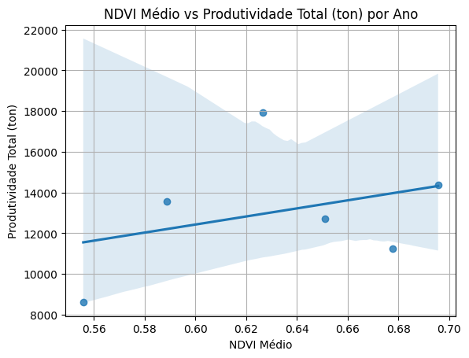
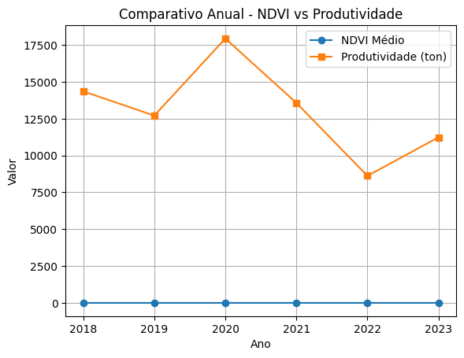
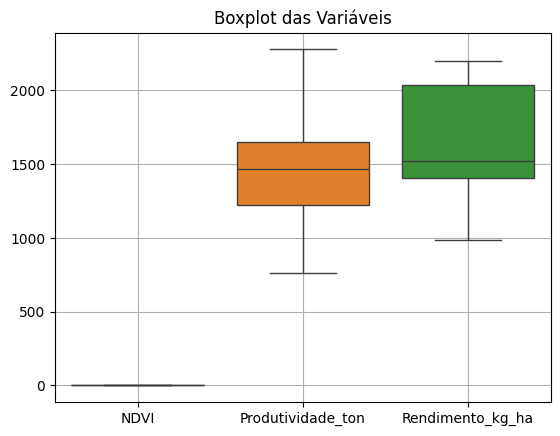

# FIAP - Faculdade de Informática e Administração Paulista

<p align="center">
<a href="https://www.fiap.com.br/"></a>
</p>

---

# Enterprise Challenge - Sprint 3 - Ingredion

### Fase 7

---

## 👨‍🎓 Integrantes:

- [Alexandre Oliveira Mantovani](https://www.linkedin.com/in/alexomantovani)
- [Edmar Ferreira Souza](https://www.linkedin.com/in/)
- [Enyd Crystina Rodrigues de Oliveira Bentivoglio](https://www.linkedin.com/in/enyd-bentivoglio-a47608364/)
- [Ricardo Lourenço Coube](https://www.linkedin.com/in/ricardolcoube/)
- [Jose Andre Filho](https://www.linkedin.com/in/joseandrefilho)

## 👩‍🏫 Professores:

- Tutor: [Leonardo Ruiz Orabona](https://www.linkedin.com/in/leonardoorabona)
- Coordenador: [André Godoi](https://www.linkedin.com/in/profandregodoi)

---

## 📌 Descrição do Projeto

Este repositório apresenta a **Sprint 3** do desafio proposto pela empresa **Ingredion**, com foco na **validação do modelo de IA** desenvolvido na Sprint 2. O objetivo é verificar a correlação entre o **NDVI** e a **produtividade real da cultura do café**, utilizando dados históricos públicos e imagens NDVI.
Como os dados públicos disponíveis não incluem informações por talhão, realizamos uma simulação controlada de dados espaciais, dividindo os valores agregados anuais em 9 talhões fictícios. Essa simulação teve como objetivo ilustrar como análises mais granulares poderiam beneficiar o modelo de IA no futuro, com uso de imagens de alta resolução ou dados de campo. a Sprint 3 do desafio proposto pela empresa Ingredion, com foco na validação do modelo de IA desenvolvido na Sprint 2. O objetivo é verificar a correlação entre o NDVI e a produtividade real da cultura do café, utilizando dados históricos públicos e imagens NDVI.

---

## 📦 Entregáveis

### 📓 Notebook

- [`notebook/sprint3_analise.ipynb`](notebook/sprint3_analise.ipynb)

### 📊 Datasets

- [`datasets/dados_simulados_por_talhao.csv`](datasets/dados_simulados_por_talhao.csv)
- [`datasets/tabela1613.csv`](datasets/tabela1613.csv)
- [`datasets/CafeTotalSerieHist.xls`](datasets/CafeTotalSerieHist.xls)
- [`datasets/tabela-de-dados-estimativas-da-producao-e-colheita.xls`](datasets/tabela-de-dados-estimativas-da-producao-e-colheita.xls)

---

## 🧪 Metodologia

1. **Coleta de Dados:** via IBGE e NDVI públicos.
2. **Simulação por Talhão:** baseada na imagem da propriedade, NDVI e produtividade foram distribuídos entre 9 talhões.
3. **Análise Estatística:** correlação de Pearson e Spearman, regressão linear e visualizações.
4. **Discussão Crítica:** limitações da média anual de NDVI, resolução espacial e amostragem.

---

## 📈 Visualizações (Exemplo)

NDVI vs Produtividade Total



Comparação anual



NDVI vs Rendimento



---

## 📊 Métricas Calculadas

As seguintes métricas foram obtidas com base na regressão linear entre o NDVI médio e a produtividade total anual (2018–2023):

- **Correlação de Pearson:** 0.454 → correlação moderada positiva
- **Correlação de Spearman:** 0.314 → correlação fraca a moderada
- **Coeficiente de Determinação R²:** 0.206 → o modelo explica cerca de 20,6% da variabilidade na produtividade

Essas métricas reforçam que o NDVI médio anual é um preditor relevante, mas não suficiente isoladamente.

---

## 🗂️ Estrutura do Projeto

```
📦 1TIAOR20242-Challenge-Ingredion-Sprint-3
│
├── assets
│   ├──  logo-fiap.png
│   ├──  ndvirendimento.png
│   ├──  ndvixprodutividadeanual.png
│   ├──  ndvixprodutividadetotal.png
│
├── datasets
│   ├── CafeTotalSerieHist.xls
│   ├── dados_simulados_por_talhao.csv
│   ├── tabela-de-dados-estimativas-da-producao-e-colheita.xls
│   └── tabela1613.csv
│
├── notebook
│   └── sprint3_analise.ipynb
│
├── README.md
└── requirements.txt
```

---

## ✅ Requisitos para Execução

- Python 3.10+
- Jupyter Notebook ou Google Colab

```bash
pip install -r requirements.txt
```

---

## 📝 Licença

<p xmlns:cc="http://creativecommons.org/ns#" xmlns:dct="http://purl.org/dc/terms/">
Este projeto segue o modelo FIAP e está licenciado sob 
<a href="http://creativecommons.org/licenses/by/4.0/?ref=chooser-v1" target="_blank" rel="license noopener noreferrer">Attribution 4.0 International (CC BY 4.0)</a>.
</p>
